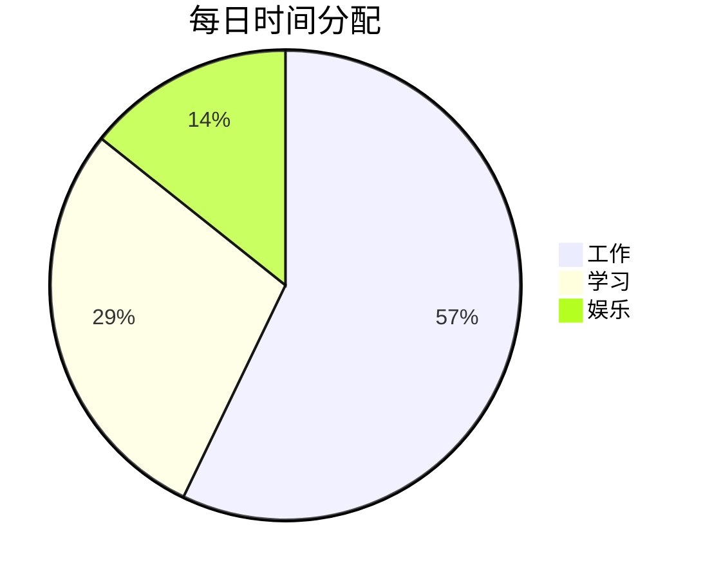
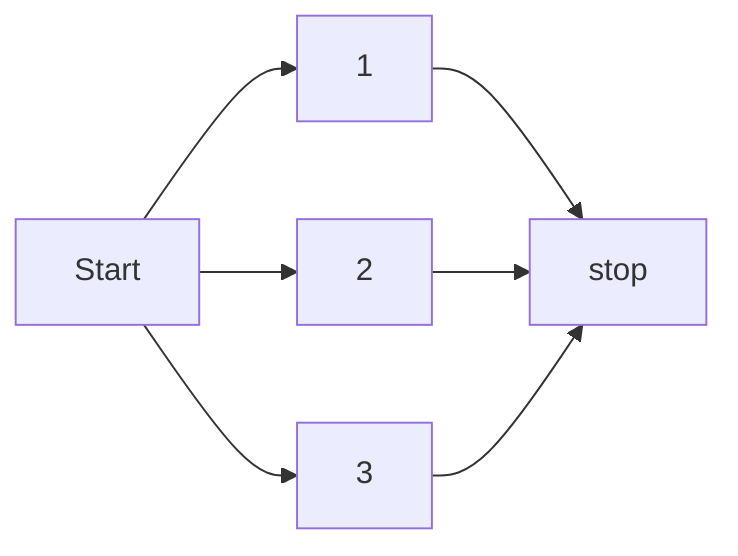

> ### Restart github Project
***
<p>本次重启学习计划将会<b>每日任务</b>。
<p> 这个project主要是学习Html5的使用，顺带熟悉markdown的应用。
  
~~学来学去还是原地踏步^.^~~ <br>

**预计每日的时间分配**

>时间就像海绵里的水，只要你愿意挤，总是会有的。

****


#### 20250917 Task
1. meirmaid初步了解
2. html初步创建
3. markdown语法

>**Today lerant**

1.meirmaid flowchart

2.
<!--防止出现乱码，以及不同设备的缩放-->
```html
<meta charset="utf-8">
<meta name="viewport" content="width=device-width, initial-scale=1.0">
```
<!--插入CSS-->
```html
<link rel="stylesheet"  href="CSS\style.css">
```


#### 20250918 Task
today no task due to busy work

#### 20251010 Task
初步制作个人主页框架

